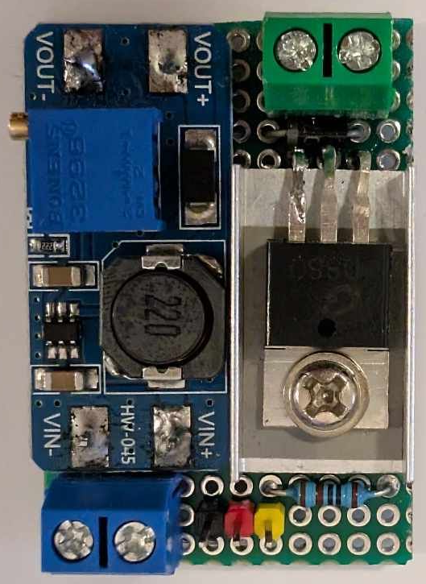
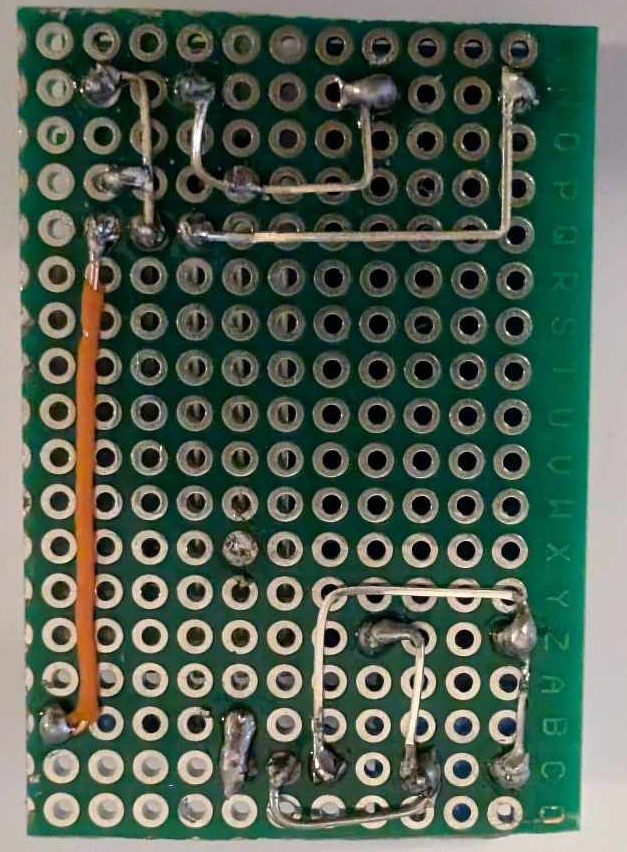
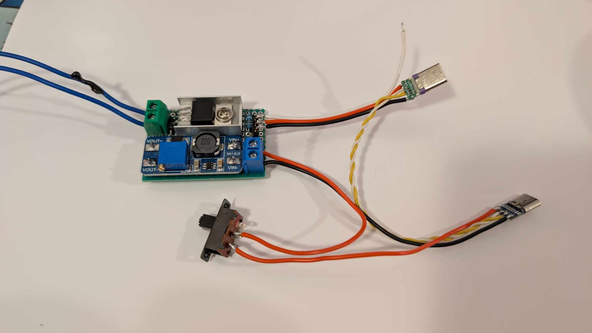
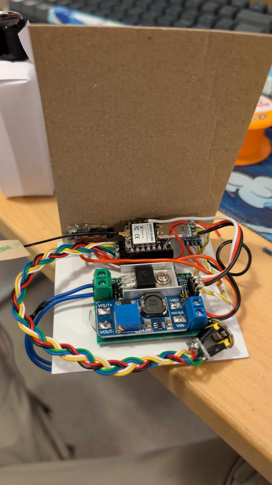

<div align="center">
  <h1>
    Ferrofluid Visualizer
  </h1>

<h4>Ever dreamed of an alien friend that dances to your music?</h4>

<p>
  <a href="#overview">Overview</a> •
  <a href="#license">License</a>
</p>


</div>

## 📜 Overview

Built on an ESP32 with an electro magnet, some leds and an I2S microphone.

## 🧮 Processing

To detect beats we are calculating the energy of the microphone signal.
We firstly use a biquad filter as low pass to isolate the beat frequencies.

<!-- But we have to keep in mind what frequencies we are looking for to mitigate the aliasing artifacts. -->

Let say we sample with a rate of $f_s=16000$,
a window size of $N=64$ and is looking for the energy of frequencies between $[0-f_c[$ where $f_c=150hz$.

We calculate the energy of the low pass filtered sampled signal using rms:

$E_{RMS}=\sqrt{\frac{1}{N}\sum_{i}x_i^2}$

If the energy is higher than the previous energy sample, we update to that value else we do a linear interpolation.

This helps with spikes, as the magnet has time to attract the fluid before settling down.

<!-- This can be use to calculate the bin size of $bin_{size}=\lceil\frac{f_c \cdot N}{f_s}\rceil\approx 10$ . -->

<!-- We are only interested in the max energy (or total), as a beat does not have to fill the range. -->

## 📃 Bill of Materials (BOM)

| Component                       | Description          | Required |
| ------------------------------- | -------------------- | -------- |
| ESP32                           | Brain of the system  | Yes      |
| Ferrofluid in bottle            | Little alien         | Yes      |
| D50H27mm 55KG, DC 12V           | Electromagnet        | Yes      |
| D880 or any other suited mosfet | Electromagnet driver | Yes      |
| N4007 or any other suited diode | Flyback diode        | Yes      |
| 1k Resistor                     |                      | Yes      |
| MT3608                          | Step up for driver   | Yes      |
| INMP441                         | I2S microphone       | Yes      |
| WS2811                          | Leds                 | No       |
| USB C Male                      |                      | No       |
| USB C Female                    |                      | No       |
| USB C Female                    |                      | No       |
| 2x Screw terminals              |                      | No       |
| Slide Switch                    | Power On / Off       | No       |

|  |  |

|  |  |

## 🔮 Getting started

1. Clone and open the new project

   ```sh
   git clone https://github.com/runeharlyk/ferrofluid-visualizer.git
   ```

<!-- 1. Configure device settings

   1. Update `factory_settings.ini` with relevant settings -->

1. Upload firmware using platformIO

## 🚀 Future

See the [open issues](https://github.com/runeharlyk/ferrofluid-visualizer/issues) for full list of proposed and active features (and known issues).

## ☕ Support

If you like the project and want to follow it evolving concidering ✨-ing the project

<a href="https://bmc.link/runeharlyk" target="_blank"></a>

<!-- ## You may also like... -->

## 📃 License

[MIT](LICENSE.md)

---

> [runeharlyk.dk](https://runeharlyk.dk) &nbsp;&middot;&nbsp;
> GitHub [@runeharlyk](https://github.com/runeharlyk) &nbsp;&middot;&nbsp;
> LinkedIn [@Rune Harlyk](https://www.linkedin.com/in/rune-harlyk/)
